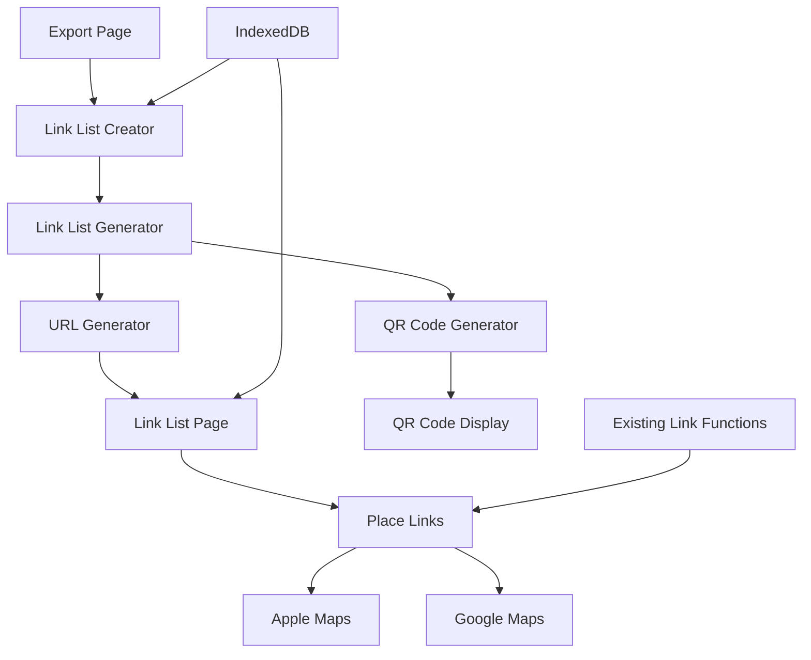

# Design Document: Link List Feature with QR Codes

## Overview

The Link List feature creates shareable web pages containing clickable links to saved places, optimized for mobile access and enhanced with QR code generation. This feature leverages Next.js 14's App Router for dynamic routing, integrates with the existing Dexie.js IndexedDB storage, and uses the `qrcode.react` library for QR code generation.

The design follows a client-side approach where Link Lists are stored locally in IndexedDB and accessed via unique URLs. Since IndexedDB data is origin-specific and cannot be shared across devices, the feature will serialize place data into the URL parameters or use a lightweight server-side storage solution for true cross-device sharing.

## Architecture

### High-Level Architecture



### Data Flow

1. **Creation Flow**: User selects places/collections → Link List Generator creates metadata → URL Generator creates shareable URL → QR Code Generator creates QR code
2. **Access Flow**: User/visitor accesses shareable URL → System loads place data → Renders mobile-optimized link list → User clicks links to open in map apps
3. **Sharing Flow**: User generates QR code → Others scan QR code → Redirects to Link List page

## Components and Interfaces

### Core Components

#### LinkListCreator Component
```typescript
interface LinkListCreatorProps {
  collections: Collection[]
  places: Place[]
}

interface LinkListCreationData {
  selectedPlaces: Place[]
  selectedCollections: Collection[]
  title: string
  description?: string
}
```

#### LinkListPage Component
```typescript
interface LinkListPageProps {
  linkListId: string
}

interface LinkListData {
  id: string
  title: string
  description?: string
  places: Place[]
  createdAt: Date
  expiresAt?: Date
}
```

#### QRCodeGenerator Component
```typescript
interface QRCodeGeneratorProps {
  url: string
  size?: number
  downloadable?: boolean
}
```

#### PlaceLink Component
```typescript
interface PlaceLinkProps {
  place: Place
  showBothLinks?: boolean
}
```

### Service Interfaces

#### LinkListService
```typescript
interface LinkListService {
  createLinkList(data: LinkListCreationData): Promise<LinkList>
  getLinkList(id: string): Promise<LinkList | null>
  deleteLinkList(id: string): Promise<void>
  getUserLinkLists(): Promise<LinkList[]>
}
```

#### URLService
```typescript
interface URLService {
  generateShareableURL(linkListId: string): string
  parseShareableURL(url: string): { linkListId: string } | null
  generateQRCodeURL(linkListId: string): string
}
```

## Data Models

### LinkList Model
```typescript
interface LinkList {
  id: string
  title: string
  description?: string
  placeIds: string[]
  collectionIds: string[]
  createdAt: Date
  updatedAt: Date
  expiresAt?: Date
  isPublic: boolean
}
```

### Extended Dexie Schema
```typescript
// Addition to existing Dexie database schema
interface PinBridgeDB extends Dexie {
  // ... existing tables
  linkLists: Table<LinkList, string>
}

const db = new Dexie('PinBridgeDB') as PinBridgeDB
db.version(2).stores({
  // ... existing stores
  linkLists: 'id, title, createdAt, isPublic'
})
```

### URL Structure Design

Given IndexedDB's origin-specific limitations, the design will use URL-encoded place data for true cross-device sharing:

**Option 1: URL Parameters (Recommended for MVP)**
```
/link-list/[id]?data=[base64-encoded-place-data]
```

**Option 2: Database Storage (Future Enhancement)**
```
/link-list/[id] (with server-side storage)
```

## Implementation Strategy

### Phase 1: Core Functionality
- Link List creation interface
- Local storage in IndexedDB
- Basic Link List page rendering
- Integration with existing link generation functions

### Phase 2: Sharing Enhancement
- URL parameter encoding for cross-device sharing
- QR code generation and display
- Mobile optimization improvements

### Phase 3: Advanced Features
- Link List management (edit, delete)
- Expiration dates
- Analytics (view counts)

## Mobile Optimization Strategy

### Responsive Design
- Touch-friendly button sizes (minimum 44px)
- Optimized typography for mobile screens
- Efficient loading with lazy rendering for large lists
- Progressive Web App compatibility

### Performance Considerations
- Minimize bundle size by code-splitting QR generation
- Lazy load QR codes only when needed
- Efficient place data serialization
- Client-side caching of generated URLs

## QR Code Implementation

### Library Selection
Based on research, `qrcode.react` is the recommended library for React applications:
- Lightweight and well-maintained
- SVG output for crisp rendering
- Customizable styling options
- TypeScript support

### QR Code Features
- Downloadable PNG/SVG formats
- Customizable colors matching app theme
- Error correction level configuration
- Size optimization for different use cases

## URL Generation Strategy

### Shareable URL Format
```
https://pinbridge.app/link-list/[unique-id]?places=[encoded-data]
```

### Data Encoding
- Base64 encoding of JSON place data
- Compression for large datasets
- URL length optimization (browser limits ~2000 chars)
- Fallback to server storage for oversized data

## Integration Points

### Export Page Integration
- Add enabled Link List card alongside Transfer Packs
- Consistent UI/UX with existing export options
- Shared place/collection selection logic

### Existing Link Generation
- Reuse `generateAppleMapsUrl()` from `src/lib/links/`
- Reuse `generateGoogleMapsUrl()` from `src/lib/links/`
- Maintain consistency with existing link behavior

### Database Integration
- Extend existing Dexie schema
- Maintain referential integrity with places/collections
- Efficient querying with proper indexing

## Correctness Properties

*A property is a characteristic or behavior that should hold true across all valid executions of a system—essentially, a formal statement about what the system should do. Properties serve as the bridge between human-readable specifications and machine-verifiable correctness guarantees.*

### Property 1: Link List Creation Completeness
*For any* valid selection of places and/or collections, creating a Link List should result in a page containing clickable links for all selected places, with each place displaying its name, address, and both Apple Maps and Google Maps links.
**Validates: Requirements 1.1, 1.2, 4.1, 4.2, 4.3**

### Property 2: Link Generation Correctness
*For any* place with valid location data, the generated Apple Maps and Google Maps links should use the existing generateAppleMapsUrl and generateGoogleMapsUrl functions and produce URLs that match the expected format patterns for their respective map applications.
**Validates: Requirements 1.3, 7.1, 7.2, 7.4**

### Property 3: URL Uniqueness and Accessibility
*For any* Link List, the generated shareable URL should be unique, persistent, and contain sufficient data to display the places across different devices without requiring authentication.
**Validates: Requirements 1.4, 5.1, 5.2, 5.3, 5.4**

### Property 4: QR Code Generation Consistency
*For any* Link List with a valid URL, the QR code generator should produce a scannable QR code containing the correct URL, be displayable on screen, downloadable as an image, and regenerate when the URL changes.
**Validates: Requirements 2.1, 2.2, 2.3, 2.4, 2.5**

### Property 5: Mobile Interface Optimization
*For any* Link List page accessed on mobile, the interface should display touch-friendly elements with minimum 44px touch targets and responsive layout that adapts to different screen sizes.
**Validates: Requirements 3.1, 3.4**

### Property 6: Collection Title Display
*For any* Link List created from collections, the page title should accurately reflect the collection name(s) used in the creation.
**Validates: Requirements 4.4**

### Property 7: Error Handling for Invalid Data
*For any* place with incomplete location data, the system should generate links with available information, handle missing data gracefully, and provide fallback options when link generation fails.
**Validates: Requirements 7.3, 7.5**

### Property 8: Data Storage Efficiency
*For any* Link List creation, the system should store minimal metadata that references existing place data rather than duplicating it, while maintaining referential integrity with the existing Dexie.js IndexedDB implementation.
**Validates: Requirements 8.1, 8.2, 8.4**

### Property 9: Cascade Updates
*For any* place that is deleted from the system, all Link Lists referencing that place should be updated to remove the reference or be marked as containing missing data.
**Validates: Requirements 8.5**

### Property 10: Invalid URL Error Handling
*For any* invalid or malformed Link List URL, the system should display an appropriate error message rather than crashing or displaying incorrect data.
**Validates: Requirements 5.5**

## Error Handling

### Client-Side Error Scenarios

1. **Invalid Place Data**: Handle places with missing coordinates, names, or addresses
2. **Network Failures**: Graceful degradation when external map services are unavailable
3. **Storage Failures**: Handle IndexedDB quota exceeded or corruption scenarios
4. **URL Parsing Errors**: Handle malformed or corrupted shareable URLs
5. **QR Code Generation Failures**: Fallback when QR code library fails

### Error Recovery Strategies

1. **Partial Data Display**: Show available place information even when some data is missing
2. **Fallback Links**: Provide alternative link formats when primary generation fails
3. **User Feedback**: Clear error messages with actionable next steps
4. **Graceful Degradation**: Core functionality remains available even when advanced features fail

### Error Logging

- Client-side error tracking for debugging
- User-friendly error messages
- Fallback UI states for error conditions

## Testing Strategy

### Dual Testing Approach

The Link List feature will use both unit testing and property-based testing for comprehensive coverage:

**Unit Tests** focus on:
- Specific examples of link generation with known place data
- Edge cases like empty collections or missing place fields
- Integration points with existing link generation functions
- UI component rendering with specific data sets
- Error conditions and fallback behaviors

**Property Tests** focus on:
- Universal properties that hold across all valid inputs
- Link generation correctness across randomized place data
- URL uniqueness and persistence across multiple generations
- QR code generation consistency with various URL inputs
- Data storage efficiency across different Link List configurations

### Property-Based Testing Configuration

- **Library**: Use `fast-check` for TypeScript/JavaScript property-based testing
- **Iterations**: Minimum 100 iterations per property test
- **Test Tagging**: Each property test tagged with format: **Feature: link-list-feature, Property {number}: {property_text}**
- **Coverage**: Each correctness property implemented by a single property-based test

### Testing Integration

- Property tests validate universal correctness properties from the design
- Unit tests validate specific examples and integration scenarios
- Both test types are complementary and required for full coverage
- Tests run as part of the existing Next.js testing pipeline

### Performance Testing

- Load testing for large Link Lists (1000+ places)
- Mobile performance validation on slower devices
- QR code generation performance with various data sizes
- URL encoding/decoding performance with large datasets